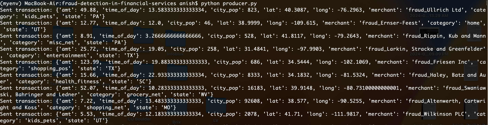
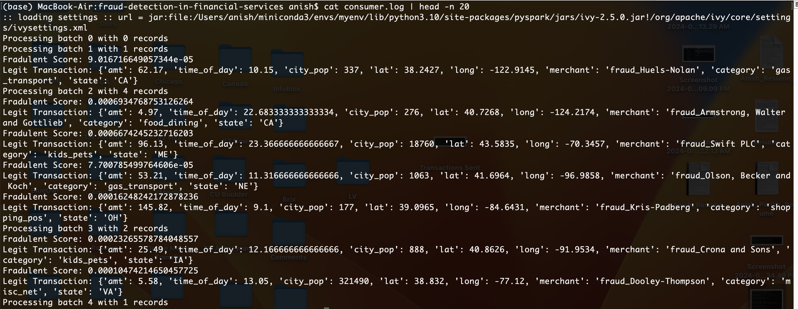
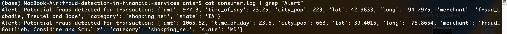

### Install Conda
- curl -O https://repo.anaconda.com/miniconda/Miniconda3-latest-MacOSX-arm64.sh
- bash Miniconda3-latest-MacOSX-arm64.sh
- conda init
- conda --version

### Create conda environment
- conda create -n myenv python=3.10
- conda activate myenv

### Install Dependencies
- conda install -c conda-forge xgboost
- pip3 install -r requirements.txt

### Switch to Java 8

- brew tap AdoptOpenJDK/openjdk
- brew install --cask adoptopenjdk8
- export JAVA_HOME=$(/usr/libexec/java_home -v 1.8)
- java -version

### Setup Kafka

- Download the latest stable release from here:- https://kafka.apache.org/downloads
- tar -xzf kafka_2.12-3.7.1.tgz
- cd kafka_2.12-2.8.0

- Edit Broker Configuration (config/server.properties). Explicitly set listener to `listeners=PLAINTEXT://localhost:9092`

- Start Zookeeper - bin/zookeeper-server-start.sh config/zookeeper.properties
- Start Kafka - bin/kafka-server-start.sh config/server.properties
- Verify Kakfa is running:- `netstat -anv | grep LISTEN | grep 9092`

### Create Kafka topic for transactions
- bin/kafka-topics.sh --create --topic transactions --bootstrap-server localhost:9092 --partitions 3 --replication-factor 1

### List topics
- bin/kafka-topics.sh --list --bootstrap-server localhost:9092

### Train the model
- Download the dataset from here:- https://drive.google.com/file/d/1yNchbhVkYf-iJEAaLWAgWT_HLoX0LotI/view?usp=drive_link
- python generate_train_test_data.py
- python train_model.py

### Start Kafka consumer
- spark-submit --packages org.apache.spark:spark-sql-kafka-0-10_2.12:3.2.0 consumer.py | tee consumer.log

### Start Kafka Producer
- python producer.py

### Alerts

- cat consumer.log | head -n 20

- cat consumer.log | grep "Alert"

